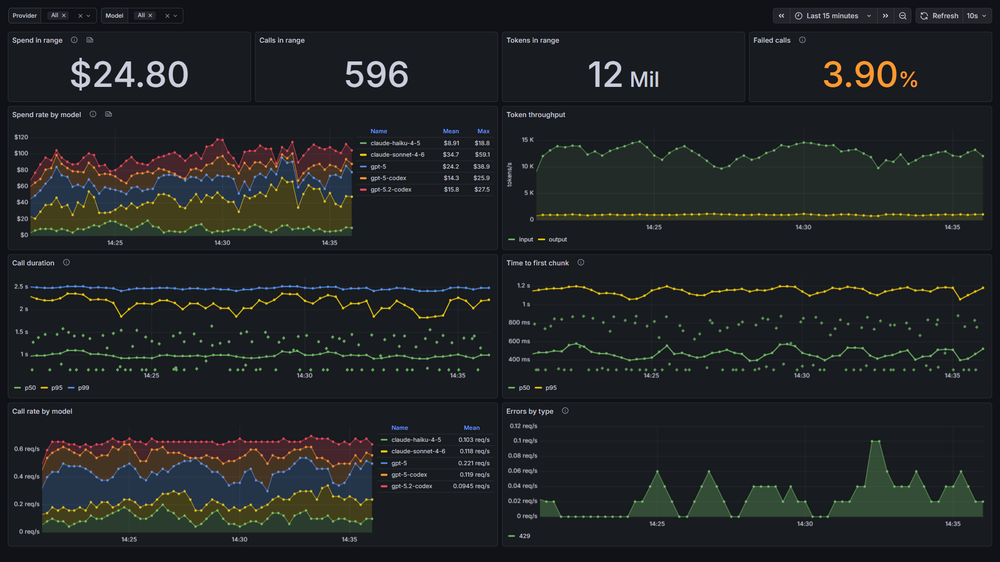
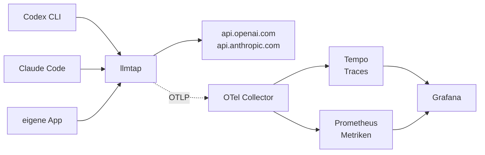

# llmtap

**Sehen, was der KI-Agent tatsächlich getan hat — ohne seinen Code anzufassen.**

`llmtap` ist ein kleiner Reverse-Proxy in Go. Man hängt ihn vor eine Modell-API,
biegt einen Client darauf um, und jeder Aufruf wird zu einem
OpenTelemetry-Span mit Token-, Kosten- und Latenzmetriken. Der Client braucht
genau eine Änderung: seine Base-URL.

*[English version](README.md)*



*Das eingerichtete Dashboard nach 15 Minuten [Demo-Verkehr](#ausprobieren-ohne-api-key). Die Punkte in den Latenz-Panels sind Exemplars: Jeder öffnet den Trace des jeweiligen Aufrufs.*



## Warum ein Proxy

Praktisch alle LLM-Observability-Werkzeuge instrumentieren das SDK — man muss
also die Anwendung ändern. Das funktioniert genau so lange, bis das, was die
Aufrufe macht, ein fertiges Binary ist: Codex CLI, Claude Code, ein
Hersteller-Tool, das Skript eines Kollegen. Was man nicht gebaut hat, kann man
nicht patchen.

Ein Proxy setzt eine Ebene tiefer an, wo alles schlicht HTTP spricht. Er ist
damit von Haus aus sprachunabhängig und sieht auch den Verkehr von Werkzeugen,
deren Quellcode man nie bekommen wird.

## Schnellstart

```bash
git clone https://github.com/stefbartucca-rgb/llmtap && cd llmtap
docker compose -f deploy/docker-compose.yml up -d
```

Das startet llmtap auf `:8080` samt OpenTelemetry Collector, Tempo, Prometheus
und Grafana auf `:3000` — Dashboard bereits eingerichtet.

Danach einen Client umbiegen:

```bash
export OPENAI_BASE_URL=http://localhost:8080/v1     # OpenAI-SDKs
export ANTHROPIC_BASE_URL=http://localhost:8080     # Claude Code
```

Für Codex CLI [`examples/codex/config.toml`](examples/codex/config.toml) nach
`~/.codex/config.toml` kopieren. Der Rest steht in [`examples/`](examples/).

Eine Aufgabe laufen lassen, dann <http://localhost:3000> öffnen und
**llmtap — Model traffic** ansehen.

### Nur der Proxy

Wer schon einen Collector betreibt, nimmt statt eines eigenen Builds das
fertige Image für linux/amd64 und linux/arm64:

```bash
docker run --rm -p 8080:8080 \
  -e LLMTAP_OTLP_ENDPOINT=dein-collector:4318 \
  ghcr.io/stefbartucca-rgb/llmtap:latest
```

Für alles, was länger laufen soll, besser ein Versions-Tag wie `0.1.0`
festlegen; siehe [Releases](https://github.com/stefbartucca-rgb/llmtap/releases).

### Ausprobieren ohne API-Key

```bash
docker compose -f deploy/docker-compose.yml -f deploy/docker-compose.demo.yml up -d
```

Das Demo-Overlay ersetzt beide Upstreams durch einen lokalen Fake-Provider und
schickt laufend Aufrufe durch den Proxy, sodass sich die Dashboards binnen
einer Minute füllen. Es erfindet plausible Token-Zahlen und Cache-Treffer und
lehnt etwa jeden zwanzigsten Aufruf ab, damit die Fehler-Panels nicht leer
bleiben. Nichts verlässt den Rechner, nichts wird abgerechnet.

Ob der Stack wirklich funktioniert, prüft `node deploy/smoke-test.js`, sobald
er läuft. Das Skript schickt jede Panel-Abfrage durch Grafana und schlägt fehl,
wenn ein Panel leer bleibt, ein Latenz-Quantil unplausibel ist oder ein
Exemplar zu keinem Trace führt. Die CI führt dieselbe Prüfung bei jeder
Änderung am Stack aus.

## Was dabei herauskommt

Die Spans folgen den [OpenTelemetry-GenAI-Konventionen](https://github.com/open-telemetry/semantic-conventions-genai);
jedes Backend, das diese versteht, versteht auch llmtap.

| Span-Attribut | Beispiel |
| --- | --- |
| `gen_ai.operation.name` | `chat` |
| `gen_ai.provider.name` | `openai` |
| `gen_ai.request.model` / `gen_ai.response.model` | `gpt-5-codex` |
| `gen_ai.usage.input_tokens` / `output_tokens` | `1024` / `256` |
| `gen_ai.response.finish_reasons` | `["completed"]` |
| `error.type` | `429` |

| Metrik | Art |
| --- | --- |
| `gen_ai.client.token.usage` | Histogramm, getrennt nach `gen_ai.token.type` |
| `gen_ai.client.operation.duration` | Histogramm, Sekunden |
| `gen_ai.client.operation.time_to_first_chunk` | Histogramm, Sekunden |
| `llmtap.cost.usd` | Counter |

Kosten sind nicht Teil der Konventionen und bekommen deshalb einen eigenen
Namensraum, statt `gen_ai.*` zu besetzen, solange die Spezifikation noch in
Bewegung ist.

## Unterstützte Endpunkte

| Endpunkt | API | Genutzt von |
| --- | --- | --- |
| `POST /v1/responses` | OpenAI Responses | Codex CLI, neuere OpenAI-SDKs |
| `POST /v1/chat/completions` | OpenAI Chat Completions | die meisten SDKs und OpenAI-kompatible Anbieter |
| `POST /v1/messages` | Anthropic Messages | Claude Code, Anthropic-SDKs |

Alles andere wird unverändert durchgereicht und erzeugt keine Telemetrie —
Clients sprechen auch Endpunkte an, zu denen llmtap keine Meinung hat, und die
kaputtzumachen wäre schlimmer, als sie nicht zu messen.

## Konfiguration

Alles über Umgebungsvariablen, jede mit brauchbarem Standardwert.

| Variable | Standard | Bedeutung |
| --- | --- | --- |
| `LLMTAP_ADDR` | `:8080` | Listen-Adresse |
| `LLMTAP_OPENAI_BASE_URL` | `https://api.openai.com` | OpenAI-Upstream |
| `LLMTAP_ANTHROPIC_BASE_URL` | `https://api.anthropic.com` | Anthropic-Upstream |
| `LLMTAP_OTLP_ENDPOINT` | aus `OTEL_EXPORTER_OTLP_*` | Collector, als `host:port` |
| `LLMTAP_OTLP_INSECURE` | `true` | OTLP unverschlüsselt |
| `LLMTAP_PRICING` | `configs/pricing.yaml` | Preistabelle; leer schaltet Kosten ab |
| `LLMTAP_INJECT_STREAM_USAGE` | `true` | siehe Hinweis unten |
| `LLMTAP_BODY_LIMIT` | `67108864` | größter zu parsender Request-Body in Bytes |
| `LLMTAP_LOG_LEVEL` | `info` | `debug`, `info`, `warn`, `error` |

### Preise

[`configs/pricing.yaml`](configs/pricing.yaml) ordnet Modellen US-Dollar je
Million Token zu. **Die mitgelieferten Zahlen stammen aus öffentlichen
Zusammenfassungen und sind ein Startpunkt — vor der ersten Kostenaussage bitte
gegen die Preisseite des Anbieters prüfen.** Ein Modell, das die Tabelle nicht
kennt, bekommt keine Kosten statt falscher, und wird einmalig geloggt.

Modellnamen werden nach dem längsten passenden Präfix aufgelöst, damit
`gpt-5-codex-2026-03-01` auf den Eintrag `gpt-5-codex` fällt, ohne für jeden
Snapshot eine eigene Zeile zu brauchen.

## Entwurfsentscheidungen

**Streaming wird nie gepuffert.** Der Response-Body steckt in einem Reader, der
die Events im Vorbeifliegen mitliest, während sie zum Client unterwegs sind.
Nichts wird gesammelt, es entsteht keine Zusatzlatenz. Ein Test blockiert, falls
das je verloren geht.

**Ein Telemetriefehler ist nie ein Aufruffehler.** Die Parser laufen hinter
einem `recover`, ein unlesbares Payload wird verworfen, ein nicht erreichbarer
Collector ignoriert. Einen Aufruf schlecht zu beobachten ist ein Bug; einen
Aufruf kaputtzumachen ist ein Ausfall.

**Chat Completions braucht einen Schubs.** Ein gestreamter Chat-Completions-Aufruf
liefert überhaupt keine Token-Zahlen, wenn der Request nicht
`stream_options.include_usage` gesetzt hat. llmtap ergänzt das; der Client sieht
dafür einen zusätzlichen letzten Chunk. Mit
`LLMTAP_INJECT_STREAM_USAGE=false` abschaltbar — dann fehlen die Token-Metriken
für diese Aufrufe, statt geschätzt zu werden, denn die Konventionen verbieten
es, Usage zu melden, die nicht zuverlässig ermittelt werden konnte.

**Cache-Token zählen die Anbieter unterschiedlich.** OpenAI rechnet die
gecachten Token in `prompt_tokens` mit ein, Anthropic meldet
`cache_read_input_tokens` getrennt. Beides gleich zu behandeln verrechnet
praktisch jeden Aufruf eines Coding-Agents, weil davon fast alle den Cache
treffen.

**Zugangsdaten werden nie aufgezeichnet.** Authorization-Header werden
unverändert weitergereicht und landen weder in einem Span noch in einer Metrik
oder einem Log. Prompt- und Antworttexte sind laut Konvention Opt-in und
bleiben aus. Ein Test prüft, dass ein durchgereichter Key in der exportierten
Telemetrie nirgends auftaucht.

## Entwicklung

```bash
go test ./...              # Unit-Tests
go test ./... -race        # wie in der CI; braucht cgo, also eine C-Toolchain
go build ./cmd/llmtap
```

Unter Windows ohne gcc steht `-race` nicht zur Verfügung — die CI fährt es
unter Linux.

Die Parser-Tests spielen mitgeschnittene SSE-Streams aus
`internal/wire/testdata/` ab, darunter einen Fall, der den Stream Byte für Byte
einspeist — an Chunk-Grenzen gehen Streaming-Parser kaputt.

## Ausblick

- Eigene Collector-Distribution mit `ocb`, die die Kostenberechnung aus dem
  Proxy in die Pipeline verlagert
- MCP-Tracing, damit die Tool-Aufrufe eines Agents im selben Trace landen wie
  seine Modellaufrufe
- Budget-Limits, die Aufrufe oberhalb einer Schwelle ablehnen
- Ein Helm-Chart

## Lizenz

Apache 2.0 — siehe [LICENSE](LICENSE).
