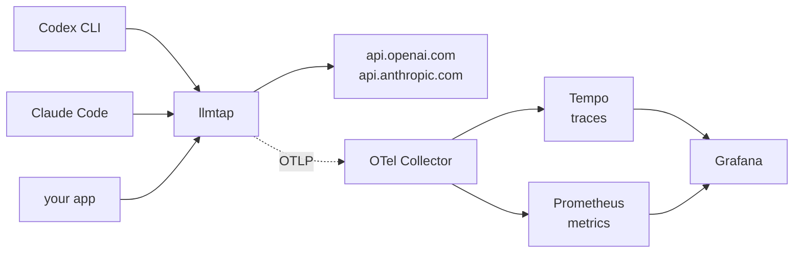

# llmtap

**See what your AI coding agent actually did — without touching its code.**

`llmtap` is a small reverse proxy in Go. Put it in front of a model API, point a
client at it, and every call turns into an OpenTelemetry span with token, cost
and latency metrics. The client needs one change: its base URL.

*[Deutsche Fassung](README.de.md)*



## Why a proxy

Nearly every LLM observability tool instruments the SDK, which means editing
the application. That works right up until the thing making the calls is a
finished binary — Codex CLI, Claude Code, a vendor tool, a colleague's script.
You cannot patch what you did not build.

A proxy sits a layer lower, where everything speaks plain HTTP. It is
language-agnostic by construction, and it sees traffic from tools whose source
you will never have.

## Quick start

```bash
git clone https://github.com/stefbartucca-rgb/llmtap && cd llmtap
docker compose -f deploy/docker-compose.yml up -d
```

That starts llmtap on `:8080` along with an OpenTelemetry Collector, Tempo,
Prometheus, and Grafana on `:3000` with a dashboard already provisioned.

Then point a client at it:

```bash
export OPENAI_BASE_URL=http://localhost:8080/v1     # OpenAI SDKs
export ANTHROPIC_BASE_URL=http://localhost:8080     # Claude Code
```

For Codex CLI, copy [`examples/codex/config.toml`](examples/codex/config.toml)
into `~/.codex/config.toml`. See [`examples/`](examples/) for the rest.

Run a task, then open <http://localhost:3000> and look at **llmtap — Model
traffic**.

### Trying it without an API key

```bash
docker compose -f deploy/docker-compose.yml -f deploy/docker-compose.demo.yml up -d
```

The demo overlay swaps both upstreams for a local fake provider and drives a
trickle of calls through the proxy, so the dashboards fill up within a minute.
It makes up plausible token counts and cache hits, and rejects roughly one call
in twenty so the error panels have something to show. Nothing leaves the
machine and nothing is billed.

To check that the stack really works, run `node deploy/smoke-test.js` once it
is up. It sends every panel query through Grafana and fails if a panel stays
empty, if a latency quantile is implausible, or if an exemplar does not lead
to a trace. CI runs the same check on every change that touches the stack.

## What you get

Spans follow the [OpenTelemetry GenAI semantic
conventions](https://github.com/open-telemetry/semantic-conventions-genai), so
any backend that understands them understands llmtap.

| Span attribute | Example |
| --- | --- |
| `gen_ai.operation.name` | `chat` |
| `gen_ai.provider.name` | `openai` |
| `gen_ai.request.model` / `gen_ai.response.model` | `gpt-5-codex` |
| `gen_ai.usage.input_tokens` / `output_tokens` | `1024` / `256` |
| `gen_ai.response.finish_reasons` | `["completed"]` |
| `error.type` | `429` |

| Metric | Kind |
| --- | --- |
| `gen_ai.client.token.usage` | histogram, split by `gen_ai.token.type` |
| `gen_ai.client.operation.duration` | histogram, seconds |
| `gen_ai.client.operation.time_to_first_chunk` | histogram, seconds |
| `llmtap.cost.usd` | counter |

Cost is not part of the conventions, so it lives under its own prefix rather
than squatting `gen_ai.*` while that spec is still moving.

## Supported endpoints

| Endpoint | API | Used by |
| --- | --- | --- |
| `POST /v1/responses` | OpenAI Responses | Codex CLI, newer OpenAI SDKs |
| `POST /v1/chat/completions` | OpenAI Chat Completions | most SDKs and OpenAI-compatible providers |
| `POST /v1/messages` | Anthropic Messages | Claude Code, Anthropic SDKs |

Anything else is forwarded untouched and produces no telemetry — clients talk
to endpoints llmtap has no opinion about, and breaking those would be worse
than missing them.

## Configuration

All settings are environment variables; every one has a working default.

| Variable | Default | Meaning |
| --- | --- | --- |
| `LLMTAP_ADDR` | `:8080` | Listen address |
| `LLMTAP_OPENAI_BASE_URL` | `https://api.openai.com` | OpenAI upstream |
| `LLMTAP_ANTHROPIC_BASE_URL` | `https://api.anthropic.com` | Anthropic upstream |
| `LLMTAP_OTLP_ENDPOINT` | from `OTEL_EXPORTER_OTLP_*` | Collector, as `host:port` |
| `LLMTAP_OTLP_INSECURE` | `true` | Plaintext OTLP |
| `LLMTAP_PRICING` | `configs/pricing.yaml` | Price table; empty disables cost |
| `LLMTAP_INJECT_STREAM_USAGE` | `true` | See the note below |
| `LLMTAP_BODY_LIMIT` | `67108864` | Largest request body to parse, in bytes |
| `LLMTAP_LOG_LEVEL` | `info` | `debug`, `info`, `warn`, `error` |

### Prices

[`configs/pricing.yaml`](configs/pricing.yaml) maps models to USD per million
tokens. **The shipped numbers are a starting point collected from public
summaries — verify them against your provider's pricing page before trusting a
cost figure.** A model missing from the table reports no cost rather than a
wrong one, and is logged once.

Model names match longest-prefix-first, so `gpt-5-codex-2026-03-01` resolves to
the `gpt-5-codex` entry without needing one row per snapshot.

## Design notes

**Streaming is never buffered.** The response body is wrapped in a reader that
parses events as they pass through on their way to the client. Nothing is
accumulated, and no latency is added. There is a test that deadlocks if this
ever regresses.

**Telemetry failure is never call failure.** Parsers run behind a recover, an
unparseable payload is dropped, and an unreachable collector is ignored.
Observing a call badly is a bug; breaking a call is an outage.

**Chat Completions needs a nudge.** A streamed Chat Completions call reports no
token counts at all unless the request set `stream_options.include_usage`.
llmtap adds it, which costs the client one extra final chunk. Set
`LLMTAP_INJECT_STREAM_USAGE=false` to disable that; token metrics for those
calls then disappear rather than being guessed, because the conventions
prohibit reporting usage that could not be obtained reliably.

**Cache tokens are counted differently per provider.** OpenAI includes cached
tokens in `prompt_tokens`; Anthropic reports `cache_read_input_tokens`
separately. Treating them the same misprices nearly every call a coding agent
makes, since almost all of them hit the cache.

**Credentials are never recorded.** Authorization headers are forwarded
untouched and never land in a span, a metric or a log. Prompt and response text
is opt-in per the conventions and is off. A test asserts that a key passed
through the proxy appears nowhere in the exported telemetry.

## Development

```bash
go test ./...              # unit tests
go test ./... -race        # as CI runs them; needs cgo, so a C toolchain
go build ./cmd/llmtap
```

On Windows without gcc, `-race` is unavailable — CI runs it on Linux.

Parser tests replay recorded SSE streams from
`internal/wire/testdata/`, including a case that feeds the stream one byte at a
time, because chunk boundaries are where streaming parsers break.

## Roadmap

- A custom Collector distribution built with `ocb`, moving cost calculation out
  of the proxy and into the pipeline
- MCP tracing, so an agent's tool calls join the same trace as its model calls
- Budget limits that reject calls past a threshold
- A Helm chart

## License

Apache 2.0 — see [LICENSE](LICENSE).
